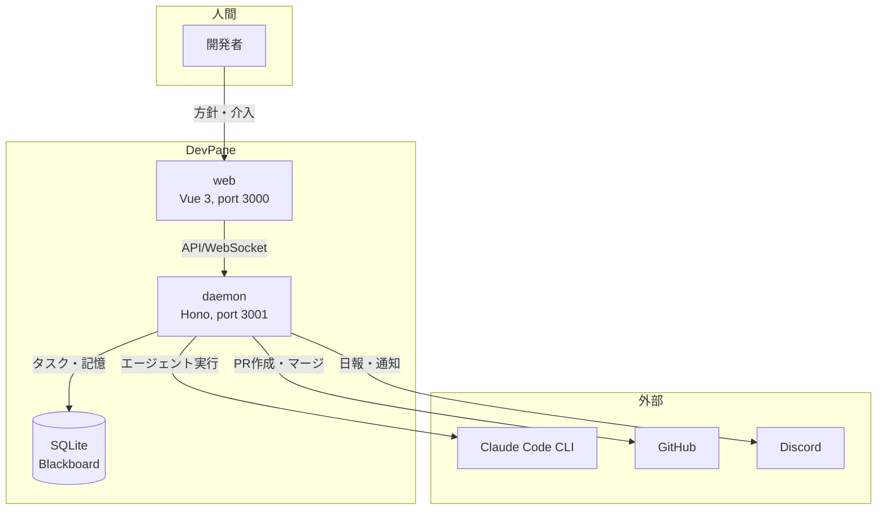

# プロジェクト概要

> Status: Active
> 最終更新: 2026-03-15

本ドキュメントは、DevPane全体を1枚で把握するための概要を記載する。

---

## 一言で言うと

DevPaneは、個人開発者のためのAI自律開発デーモンである。階層型マルチエージェント（PM→Worker）が常駐でタスクを消化し、人間はブラウザからチャットで介入するだけでよい。

---

## 背景

| 項目 | 内容 |
|------|------|
| 現状の課題 | AIコーディングツールは人間がトリガーを引く必要がある。寝ている間は開発が止まる |
| 解決アプローチ | 常駐デーモンがタスクキューを自律消化する。人間は方針を決めて日報を見るだけ |

---

## 主要機能

| 機能 | 説明 |
|------|------|
| 自律タスク生成 | PMがCLAUDE.md・記憶・履歴を読み、構造化仕様を生成する |
| worktree隔離実行 | Workerがgit worktreeで隔離された環境でTDD実装する |
| Observable Facts判定 | exit code・diff・テスト結果で客観的に完了を判定する |
| 3段Gate審査 | 方針チェック・仕様-テスト照合・成果物判定の3段階で品質を担保する |
| 自己改善ループ | なぜなぜ分析→改善→効果測定のダブル/トリプルループで上方スパイラルを形成する |
| PR Agent日報 | 日次でPR一覧をDiscordに投稿し、人間は番号指定でマージ/クローズする |

---

## 対象ユーザー

| ユーザー種別 | 説明 | 主な利用シーン |
|--------------|------|----------------|
| 個人開発者 | 方針だけ決めて放置したい開発者 | 寝る前にdaemon起動、朝にDiscord日報を確認 |

---

## システム概観

---

## 設計原理

DevPaneの設計全体を貫く3つの原理を定義する。

| 原理 | 内容 |
|------|------|
| LLMは変換器 | LLMは入力→出力の変換だけを担う。フロー制御・状態遷移・Gate判定はコードで行う |
| Blackboardが真実 | SQLiteが共有知識ベース。エージェントは内部状態を持たず、Blackboardに読み書きする |
| Contractで境界 | エージェント間の入出力はZodスキーマで検証する。型が通らないものはパイプラインに入れない |

---

## 関連ドキュメント

- [目的・解決する課題](./goals.md) - プロジェクトの目的と成功基準
- [スコープ・対象外](./scope.md) - 対象範囲とフェーズ分割
- [システム境界・外部連携](../02-architecture/context.md) - 外部システムとの連携定義
