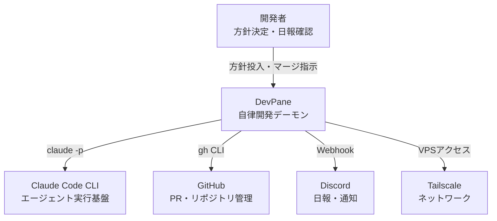

---
depends_on:
  - ../01-overview/summary.md
tags: [architecture, c4, context, boundary]
ai_summary: "DevPaneのシステム境界と外部システム連携（Claude CLI・GitHub・Discord）を定義"
---

# システム境界・外部連携

> Status: Active
> 最終更新: 2026-03-15

本ドキュメントは、DevPaneの境界と外部システムとの連携を定義する（C4 Context相当）。

---

## システムコンテキスト図

---

## アクター定義

| アクター | 種別 | 説明 | 主な操作 |
|----------|------|------|----------|
| 開発者（iguchi） | 人間 | プロジェクトオーナー | 方針決定、日報確認、マージ/クローズ指示 |
| Claude Code CLI | 外部システム | LLMエージェント実行基盤 | PM・Worker・Gate・Tester・Kaizen の実行 |
| GitHub | 外部システム | コード・PR管理 | PR作成・マージ・クローズ、ブランチ管理 |
| Discord | 外部システム | 通知チャネル | 日報投稿、異常通知、マージ指示受付 |

---

## 外部システム連携

### Claude Code CLI

| 項目 | 内容 |
|------|------|
| 概要 | LLMエージェントの実行基盤。全エージェントロールの実体 |
| 連携方式 | `claude -p` コマンドのspawn実行 |
| 連携データ | プロンプト（入力）→ JSON応答（出力） |
| 連携頻度 | タスクごとに複数回（PM・Gate・Worker） |
| 依存度 | 必須。DevPaneの中核 |

### GitHub

| 項目 | 内容 |
|------|------|
| 概要 | コードホスティングとPR管理 |
| 連携方式 | `gh` CLI経由 |
| 連携データ | PR作成・一覧取得・マージ・クローズ |
| 連携頻度 | タスク完了時（PR作成）、日次（PR Agent） |
| 依存度 | 必須 |

### Discord

| 項目 | 内容 |
|------|------|
| 概要 | 人間への通知チャネル |
| 連携方式 | Webhook |
| 連携データ | PR Agent日報テーブル、異常アラート |
| 連携頻度 | 日次（日報）、イベント駆動（異常時） |
| 依存度 | オプション。通知なしでもループは回る |

---

## システム境界

### 内部（DevPaneの責務）

| 責務 | 説明 |
|------|------|
| タスクオーケストレーション | PM→Gate→Tester→Worker→Gate→PRの制御 |
| 状態管理 | SQLite（Blackboard）によるタスク・記憶・メトリクス管理 |
| 品質担保 | 3段Gate審査、Observable Facts収集 |
| 自己改善 | なぜなぜ分析、効果測定、Gate/PMテンプレート更新 |
| 通知・報告 | Discord日報、Web UI表示 |

### 外部（DevPaneの責務外）

| 項目 | 担当 | 説明 |
|------|------|------|
| LLM推論 | Claude Code CLI / Anthropic | コード生成・分析の実行 |
| コードホスティング | GitHub | リポジトリ管理・PRレビューUI |
| 認証・課金 | Anthropic Max plan | Claude CLIの認証とレート制限 |

---

## 関連ドキュメント

- [プロジェクト概要](../01-overview/summary.md) - 1枚で全体像を把握
- [主要コンポーネント構成](./structure.md) - 内部コンポーネントの責務と通信
