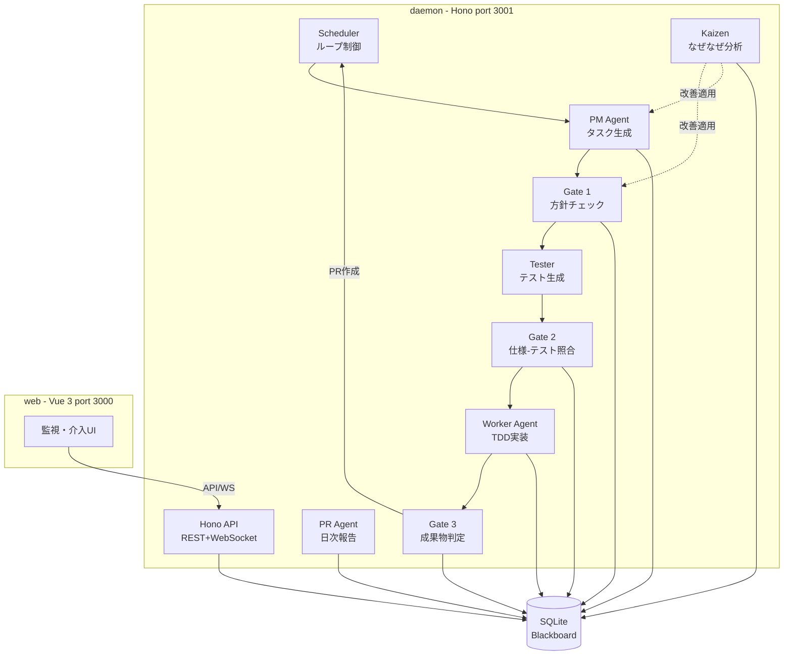

---
depends_on:
  - ./context.md
tags: [architecture, c4, container, components]
ai_summary: "DevPaneの主要コンポーネント（Scheduler・PM・Worker・Gate・Tester・Kaizen）の構成と責務を定義"
---

# 主要コンポーネント構成

> Status: Active
> 最終更新: 2026-03-15

本ドキュメントは、DevPaneの主要コンポーネントとその関係を定義する（C4 Container相当）。

---

## コンポーネント構成図



---

## コンポーネント一覧

| コンポーネント | 種別 | 責務 | 技術 |
|----------------|------|------|------|
| Scheduler | ループ制御 | パイプラインの起動・停止・heartbeat | TypeScript |
| PM Agent | タスク生成 | CLAUDE.md・記憶・履歴→構造化仕様 | Claude CLI |
| Gate 1/2/3 | 品質ゲート | Go/Kill/Recycle判定 | コード + Claude CLI |
| Tester | テスト生成 | 構造化仕様→テストファイル | Claude CLI |
| Worker Agent | 実装 | テストを通すTDD実装 | Claude CLI + worktree |
| Kaizen | 自己改善 | なぜなぜ分析・効果測定 | Claude CLI + コード |
| PR Agent | 日次報告 | PR要約・Discord日報・マージ実行 | Claude CLI + gh CLI |
| Hono API | REST/WS | Web UIへのデータ提供 | Hono |
| Web UI | 監視・介入 | タスク一覧・ログ・チャット | Vue 3 |
| SQLite | データ層 | Blackboard（全状態の単一ソース） | better-sqlite3 |

---

## コンポーネント間通信

| 送信元 | 送信先 | プロトコル | 内容 |
|--------|--------|------------|------|
| Scheduler | PM Agent | CLI spawn | タスク生成要求 |
| PM Agent | SQLite | SQL | タスク・記憶の読み書き |
| Scheduler | Worker | CLI spawn | タスク実行指示 |
| Worker | SQLite | SQL | ログ・Facts記録 |
| Gate 1/2/3 | SQLite | SQL | 判定結果記録 |
| Kaizen | SQLite | SQL | 改善履歴・効果測定 |
| Web UI | Hono API | HTTP/WebSocket | 状態取得・介入操作 |
| PR Agent | GitHub | gh CLI | PR作成・マージ |
| PR Agent | Discord | Webhook | 日報投稿 |

---

## ディレクトリ構成

```
devpane/
├── packages/
│   ├── daemon/       # Hono API + エージェントオーケストレーション
│   ├── web/          # Vue 3 監視UI
│   └── shared/       # 共通型定義・Zodスキーマ
├── design/           # 設計ドキュメント（templarc）
├── pnpm-workspace.yaml
└── CLAUDE.md
```

---

## 関連ドキュメント

- [システム境界・外部連携](./context.md) - 外部システムとの連携定義
- [技術スタック](./tech-stack.md) - 技術選定と選定理由
- [データモデル](../03-details/data-model.md) - SQLiteスキーマとエンティティ定義
- [API設計](../03-details/api.md) - Hono APIエンドポイント仕様
- [主要フロー](../03-details/flows.md) - パイプラインとworktreeフローのシーケンス図
- [UI設計](../03-details/ui.md) - Web UI画面設計
