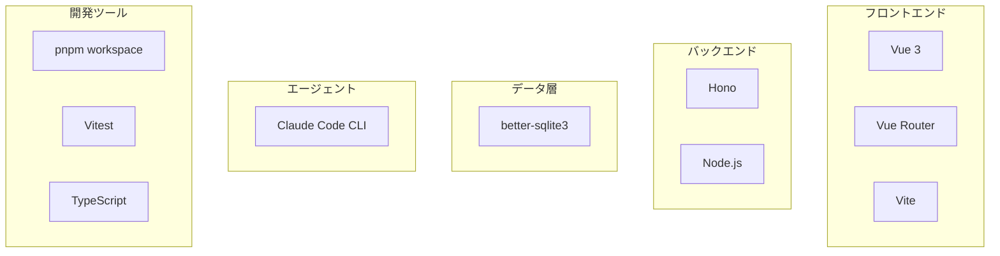

---
depends_on:
  - ./structure.md
tags: [architecture, technology, stack]
ai_summary: "DevPaneの技術スタック一覧（Hono・Vue 3・SQLite・Claude CLI）と選定理由"
---

# 技術スタック

> Status: Active
> 最終更新: 2026-03-15

本ドキュメントは、DevPaneで使用する技術スタックとその選定理由を記載する。

---

## 技術スタック概要

---

## 技術スタック一覧

### 言語・フレームワーク

| カテゴリ | 技術 | バージョン | 用途 |
|----------|------|------------|------|
| 言語 | TypeScript | ^5.7.0 | 全パッケージ共通 |
| ランタイム | Node.js | >=22 | daemon実行 |
| Webフレームワーク | Hono | ^4.0.0 | daemon APIサーバー |
| フロントエンド | Vue 3 | ^3.5.25 | Web UI |
| ルーティング | Vue Router | ^4.0.0 | Web UIルーティング |
| ビルドツール | Vite | - | Web UIバンドル |

### データベース・ストレージ

| 技術 | バージョン | 用途 |
|------|------------|------|
| better-sqlite3 | ^11.0.0 | Blackboard（タスク・記憶・メトリクス） |

### エージェント実行

| 技術 | 用途 |
|------|------|
| Claude Code CLI (`claude -p`) | 全エージェントロールの実行基盤 |
| Anthropic Max plan | 定額サブスクリプションでのLLM利用 |

### 開発ツール

| カテゴリ | 技術 | 用途 |
|----------|------|------|
| パッケージ管理 | pnpm workspace | モノレポ管理 |
| テスト | Vitest ^4.0.18 | ユニット・統合テスト |
| バリデーション | Zod ^4.3.6 | スキーマ検証（Contract） |
| ID生成 | ULID ^2.3.0 | 時系列ソート可能な一意識別子 |

---

## 技術選定理由

### Claude Code CLI（`claude -p`）

| 項目 | 内容 |
|------|------|
| 選定理由 | Max plan定額で回せる。CLIツール群がそのまま使える |
| 代替候補 | Anthropic API直接呼び出し |
| 不採用理由 | API従量課金は定額運用の方針に反する |

### better-sqlite3

| 項目 | 内容 |
|------|------|
| 選定理由 | 同期APIでdaemon内完結。ファイル1つで管理できる |
| 代替候補 | PostgreSQL, Drizzle ORM |
| 不採用理由 | 個人利用に外部DBプロセスは過剰。ORMも不要な抽象化 |

### Hono

| 項目 | 内容 |
|------|------|
| 選定理由 | 軽量でTypeScript native。Web Standard API準拠 |
| 代替候補 | Express, Fastify |
| 不採用理由 | Expressは型サポートが弱い。FastifyはHonoより重い |

---

## バージョン管理方針

| 項目 | 方針 |
|------|------|
| メジャーバージョン | Node.js LTSに追従する |
| セキュリティパッチ | 即時適用する |
| 依存関係更新 | 月次で確認する |

---

## 関連ドキュメント

- [主要コンポーネント構成](./structure.md) - コンポーネントの責務と通信
- [決定記録](../04-decisions/) - 技術選定のADR
