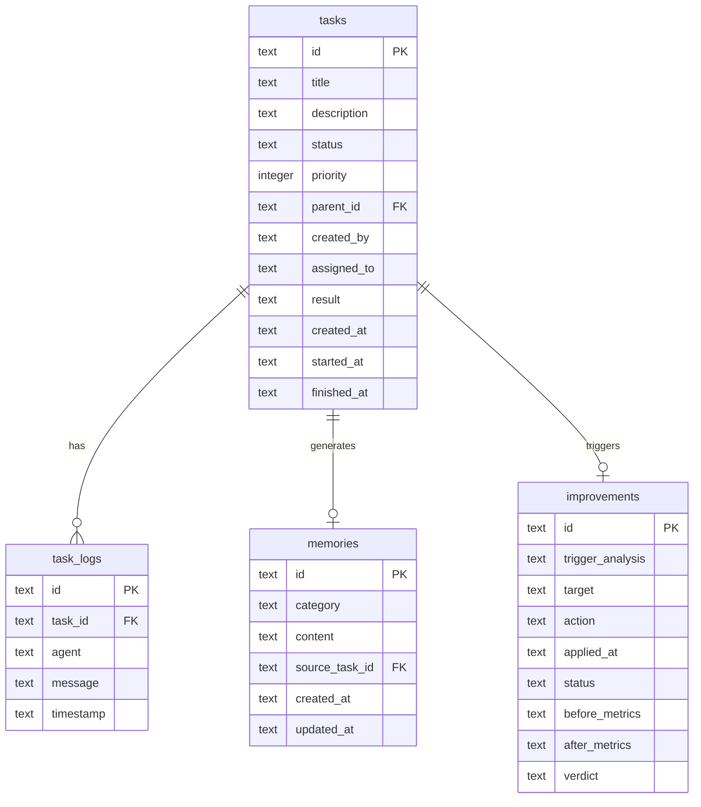
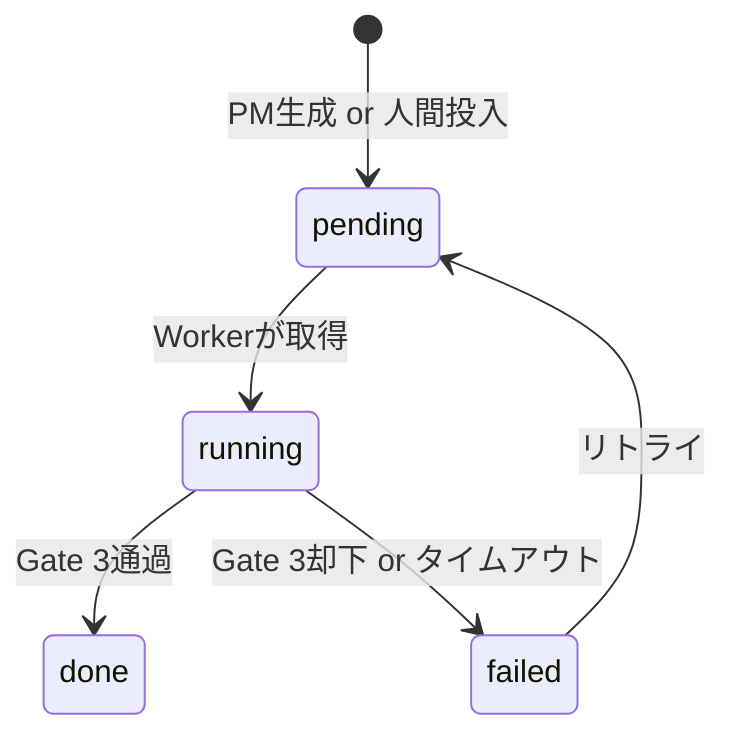

---
depends_on:
  - ../02-architecture/structure.md
tags: [details, data, er-diagram, schema]
ai_summary: "DevPaneのSQLiteスキーマ（tasks・task_logs・memories・improvements・metrics）のエンティティ定義・ER図・状態遷移"
---

# データモデル

> Status: Active
> 最終更新: 2026-03-15

本ドキュメントは、DevPaneのSQLiteデータモデルを定義する。SQLiteはBlackboard（→用語集）として全エージェントの共有知識ベースとなる。

---

## ER図

---

## エンティティ一覧

| エンティティ | 説明 | 主キー |
|--------------|------|--------|
| tasks | タスクの状態と結果 | ULID |
| task_logs | 型付きイベントログ | ULID |
| memories | PM用の記憶（feature/decision/lesson） | ULID |
| improvements | 自己改善の履歴と効果測定 | ULID |

---

## エンティティ詳細

### tasks

| カラム | 型 | 必須 | 説明 |
|--------|-----|------|------|
| id | TEXT | ○ | ULID。一意識別子 |
| title | TEXT | ○ | タスク名 |
| description | TEXT | ○ | タスクの詳細説明 |
| status | TEXT | ○ | pending / running / done / failed |
| priority | INTEGER | - | 優先度（0がデフォルト） |
| parent_id | TEXT | - | 親タスクのID（PMが分解した場合） |
| created_by | TEXT | ○ | pm / human |
| assigned_to | TEXT | - | 割当先Worker ID |
| result | TEXT | - | Observable Facts（→用語集）のJSON |
| created_at | TEXT | ○ | 作成日時（ISO 8601） |
| started_at | TEXT | - | 実行開始日時 |
| finished_at | TEXT | - | 完了日時 |

#### タスクステータス遷移

### memories

| カラム | 型 | 必須 | 説明 |
|--------|-----|------|------|
| id | TEXT | ○ | ULID |
| category | TEXT | ○ | feature / decision / lesson |
| content | TEXT | ○ | 記憶の内容 |
| source_task_id | TEXT | - | 記憶の元となったタスクID |
| created_at | TEXT | ○ | 作成日時 |
| updated_at | TEXT | ○ | 更新日時 |

### improvements

| カラム | 型 | 必須 | 説明 |
|--------|-----|------|------|
| id | TEXT | ○ | ULID |
| trigger_analysis | TEXT | ○ | なぜなぜ分析の結果JSON |
| target | TEXT | ○ | gate1 / gate2 / gate3 / pm_template |
| action | TEXT | ○ | 適用した変更内容 |
| applied_at | TEXT | ○ | 適用日時 |
| status | TEXT | ○ | active / reverted / permanent |
| before_metrics | TEXT | - | 適用前の指標JSON |
| after_metrics | TEXT | - | 適用後の指標JSON |
| verdict | TEXT | - | effective / ineffective / harmful |

---

## インデックス

| テーブル | カラム | 種別 | 目的 |
|----------|--------|------|------|
| tasks | id | PRIMARY | 主キー |
| tasks | status | INDEX | ステータス別検索 |
| task_logs | task_id | INDEX | タスク別ログ検索 |
| memories | category | INDEX | カテゴリ別検索 |

---

## 関連ドキュメント

- [主要コンポーネント構成](../02-architecture/structure.md) - コンポーネントの責務と通信
- [API設計](./api.md) - Hono APIエンドポイント仕様
