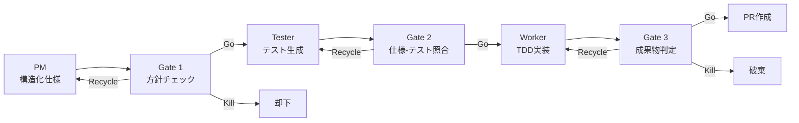
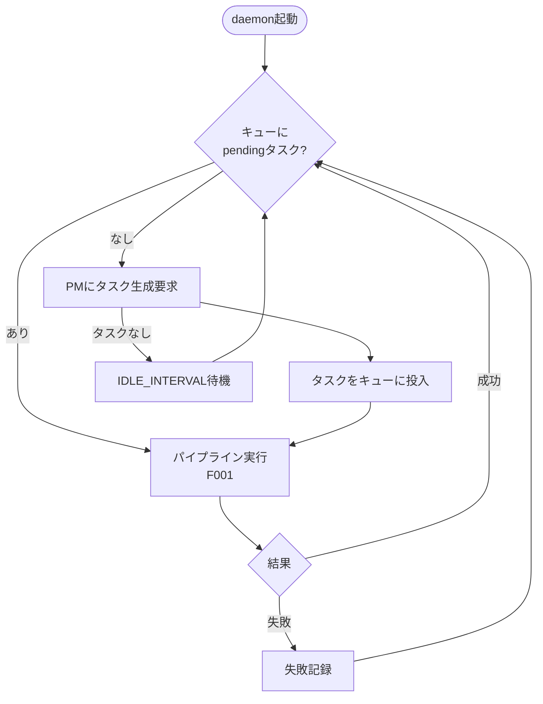
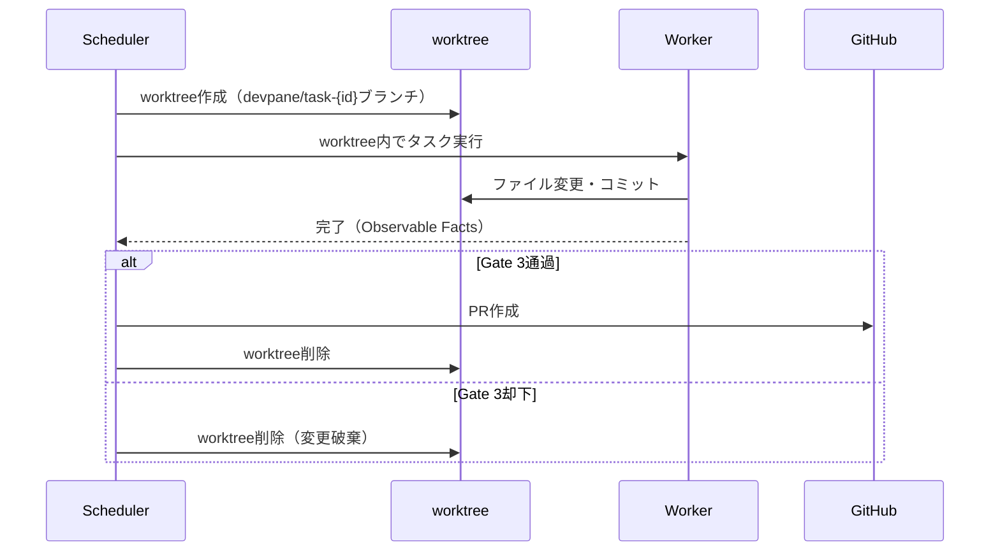
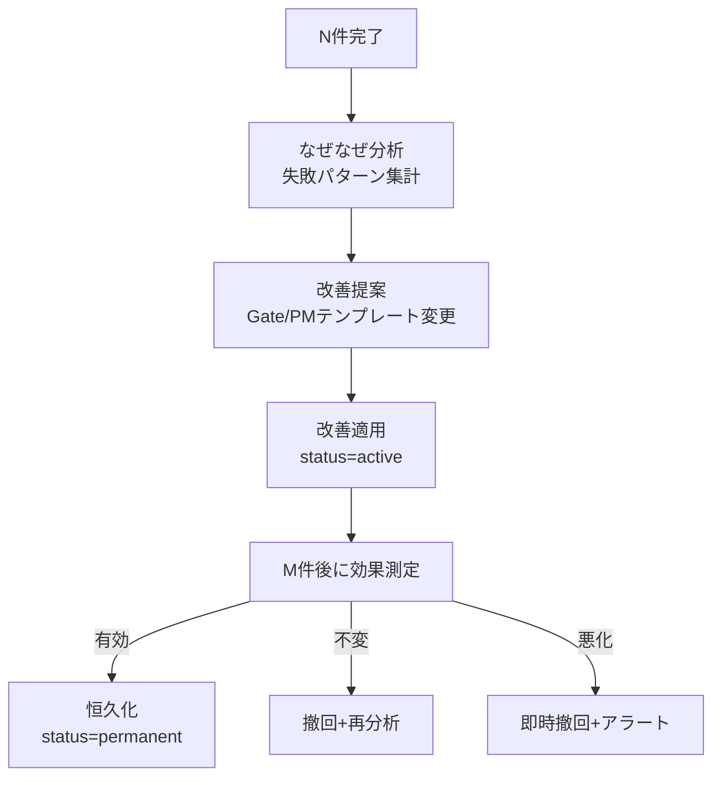

---
depends_on:
  - ../02-architecture/structure.md
tags: [details, flows, sequence, process]
ai_summary: "DevPaneの主要フロー（開発パイプライン・自律ループ・worktree隔離・自己改善・PR Agent）のシーケンス図"
---

# 主要フロー

> Status: Active
> 最終更新: 2026-03-15

本ドキュメントは、DevPaneの主要な処理フローを定義する。

---

## フロー一覧

| フローID | フロー名 | 説明 |
|----------|----------|------|
| F001 | 開発パイプライン | PM→Gate→Tester→Worker→Gate→PRの一連の処理 |
| F002 | 自律ループ | Schedulerによるパイプラインの継続的実行 |
| F003 | worktree隔離 | タスクごとのgit worktree作成・実行・マージ |
| F004 | 自己改善ループ | なぜなぜ分析→改善適用→効果測定 |
| F005 | PR Agent日報 | 日次PR要約・Discord投稿・マージ実行 |

---

## フロー詳細

### F001: 開発パイプライン

| 項目 | 内容 |
|------|------|
| 概要 | 構造化仕様の生成からPR作成までの7ステップパイプライン |
| トリガー | Schedulerがキューからタスクを取得 |
| アクター | PM・Gate 1/2/3・Tester・Worker |

#### パイプライン図

#### 処理ステップ

| # | 処理 | 担当 | 説明 |
|---|------|------|------|
| 1 | 構造化仕様生成 | PM | CLAUDE.md・記憶・履歴から仕様JSONを生成する |
| 2 | 方針チェック | Gate 1 | 方針逸脱・重複・既存機能破壊を検査する |
| 3 | テスト生成 | Tester | 仕様のinvariantsからテストファイルを生成する |
| 4 | 仕様-テスト照合 | Gate 2 | invariantsに対応するテストの存在を確認する |
| 5 | TDD実装 | Worker | worktree内でテストを通す実装を行う |
| 6 | 成果物判定 | Gate 3 | Observable Factsで客観判定する |
| 7 | PR作成+記憶更新 | Scheduler | PRを作成し、feature/decisionを記憶に記録する |

---

### F002: 自律ループ

| 項目 | 内容 |
|------|------|
| 概要 | Schedulerがパイプラインを継続的に実行する |
| トリガー | daemon起動時 |
| アクター | Scheduler・PM |

#### ループフロー

#### エラーハンドリング

| エラー | 対応 |
|--------|------|
| Worker失敗 | タスクをfailedにしてPMに報告。次タスクへ進む |
| PM呼び出し失敗 | 30秒後にリトライ。3回連続失敗で5分間クールダウン |
| レート制限 | 指数バックオフ（60s→120s→300s→最大600s） |
| 致命的エラー | ループ停止、エラーログ出力 |

---

### F003: worktree隔離

| 項目 | 内容 |
|------|------|
| 概要 | タスクごとにgit worktreeを作成し、mainブランチを保護する |
| トリガー | Workerがタスクを取得した時 |
| アクター | Worker・Scheduler |

#### worktreeライフサイクル

---

### F004: 自己改善ループ

| 項目 | 内容 |
|------|------|
| 概要 | 失敗パターンを分析し、Gate・PMテンプレートを改善する |
| トリガー | N件（デフォルト10件）のタスク完了ごと |
| アクター | Kaizen Agent・効果測定Agent |

#### 改善フロー

---

### F005: PR Agent日報

| 項目 | 内容 |
|------|------|
| 概要 | 未マージPRを日次で要約し、Discordに投稿する |
| トリガー | 日次スケジュール |
| アクター | PR Agent |

#### 処理ステップ

| # | 処理 | 担当 | 説明 |
|---|------|------|------|
| 1 | 未マージPR一覧取得 | PR Agent | GitHub APIで取得する |
| 2 | 安全性評価 | PR Agent | diff規模・テスト結果・影響範囲を分析する |
| 3 | Discord投稿 | PR Agent | テーブル形式で推奨/要確認/非推奨を表示する |
| 4 | マージ指示受付 | PR Agent | 人間の番号指定でマージ/クローズを実行する |
| 5 | 記憶フィードバック | PR Agent | マージ→decision、クローズ→lessonとして記録する |

---

## 関連ドキュメント

- [データモデル](./data-model.md) - SQLiteスキーマとエンティティ定義
- [API設計](./api.md) - Hono APIエンドポイント仕様
- [UI設計](./ui.md) - Web UI画面設計
