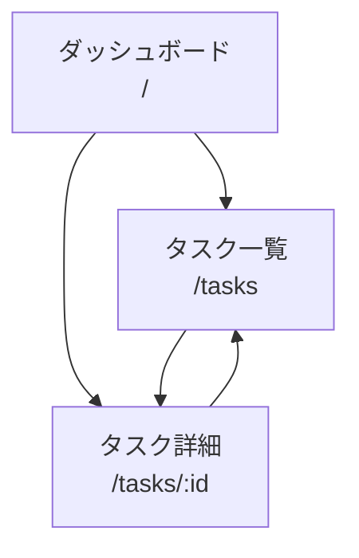

---
depends_on:
  - ../02-architecture/structure.md
  - ./flows.md
tags: [details, ui, screens, interactions]
ai_summary: "DevPaneのWeb UI画面一覧（ダッシュボード・タスク一覧・タスク詳細）と介入レベル定義"
---

# UI設計

> Status: Draft
> 最終更新: 2026-03-15

本ドキュメントは、DevPaneのWeb UI（「オフィスの窓」）設計を定義する。Phase 2の実装対象。

---

## 画面一覧

| 画面ID | 画面名 | パス | 説明 |
|--------|--------|------|------|
| S001 | ダッシュボード | `/` | タスク一覧・ステータス・コスト・SPC管理図 |
| S002 | タスク一覧 | `/tasks` | 全タスクのフィルタリング・検索 |
| S003 | タスク詳細 | `/tasks/:id` | 構造化仕様・ログ・diff・Observable Facts |

---

## 画面遷移図

---

## 画面詳細

### S001: ダッシュボード

| 項目 | 内容 |
|------|------|
| パス | `/` |
| 目的 | プロジェクトの健康状態を一目で把握する |

#### 構成要素

| 要素 | 種別 | 説明 |
|------|------|------|
| タスクサマリ | カード | pending/running/done/failedの件数 |
| 直近タスク | リスト | 最新5件のタスク状態 |
| イベントフィード | リスト | リアルタイムイベント（WebSocket） |
| スケジューラ状態 | バッジ | running/paused/error |

### S002: タスク一覧

| 項目 | 内容 |
|------|------|
| パス | `/tasks` |
| 目的 | 全タスクの検索・フィルタリング |

#### 構成要素

| 要素 | 種別 | 説明 |
|------|------|------|
| ステータスフィルタ | タブ | pending/running/done/failedで絞り込み |
| タスクテーブル | テーブル | ID・タイトル・ステータス・作成日時 |
| タスク作成ボタン | ボタン | 手動タスク投入 |

### S003: タスク詳細

| 項目 | 内容 |
|------|------|
| パス | `/tasks/:id` |
| 目的 | 個別タスクの全情報を確認する |

#### 構成要素

| 要素 | 種別 | 説明 |
|------|------|------|
| タスクメタ情報 | カード | タイトル・ステータス・作成者・優先度 |
| Observable Facts | テーブル | exit code・diff stats・テスト結果 |
| エージェントログ | リスト | PM・Worker・Gateのログ時系列表示 |

---

## 介入レベル

Web UIは「オフィスの窓」である。正常時は眺めるだけ、異常時だけ介入する。

| レベル | 操作 | 説明 |
|--------|------|------|
| 0 | 放置 | Discordの日報だけ見る。番号でマージ指示 |
| 1 | 方針調整 | チャットで一言。CLAUDE.md編集。次サイクルで反映 |
| 2 | タスク介入 | 不要タスクをキャンセル、手動タスクを追加 |
| 3 | 緊急停止 | スケジューラ一時停止。状況確認後に再開 |
| 4 | 記憶修正 | PMの記憶を直接編集 |
| 5 | 改善介入 | 自己改善の結果を手動撤回 |

---

## 関連ドキュメント

- [主要フロー](./flows.md) - パイプラインフローのシーケンス図
- [主要コンポーネント構成](../02-architecture/structure.md) - コンポーネントの責務と通信
