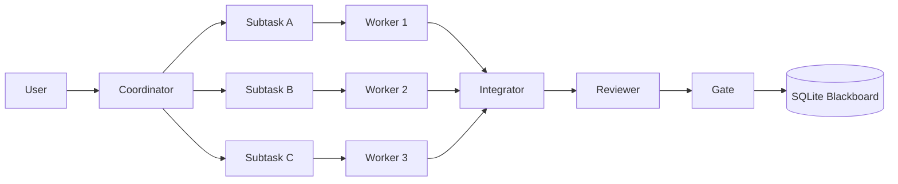

---
depends_on:
  - ../02-architecture/structure.md
  - ../03-details/flows.md
  - ./brainstorm_2026-03-10.md
tags: [appendix, orchestration, multi-worker, roadmap]
ai_summary: "Shogun系の階層委譲を一般名詞の役割へ置き換え、DevPaneを1 Coordinator : N Workers構成へ拡張するための移行メモ"
---

# Multi-Worker Orchestration メモ (2026-03-17)

> Status: Proposed
> 最終更新: 2026-03-17

本メモは、Shogun系の「階層委譲」「専有ワーカー」「イベント駆動」の枠組みだけを借り、DevPane向けに一般化した multi-worker 構成を整理する。

---

## 背景

現行の DevPane は、PM → Gate → Tester → Worker → Gate の単線パイプラインを前提としている。これは安全だが、親 issue を複数の実装単位へ分割して同時進行する構造にはなっていない。

一方で、DevPane にはすでに以下の土台がある。

- SQLite blackboard による状態の一元管理
- worktree による物理隔離
- Observable Facts による deterministic な判定
- API 化されたエージェント呼び出し境界

したがって、次段階では「別サービス化」より先に「1つの親タスクを複数 worker へ安全に委譲できる構造」を入れる価値が高い。

---

## 目標

- 親 task を複数 subtask に分解し、複数 worker が並列に処理できるようにする
- 各 worker の作業を専用 worktree と固定 base commit に束縛し、並列実行時の衝突を管理できるようにする
- 統合判断を AI の裁量ではなく queue / test / observable facts で決める
- 役割名は一般名詞に統一し、特定プロジェクトの固有表現を持ち込まない

---

## 非目標

- いきなり PM / Worker を別ホストのマイクロサービスへ分割すること
- AI に自由形式でマージ競合の可否を判断させること
- UI 名称や演出を Shogun 風の役職名に寄せること

---

## 提案する役割

| 役割 | 責務 | 備考 |
|------|------|------|
| Coordinator | 親 task の分解、subtask の依存関係定義、worker への割当 | 現行 PM を拡張した上位オーケストレータ |
| Worker | 1つの subtask を専用 worktree で実装する | sibling subtask には触れない |
| Reviewer | 変更内容・テスト・observable facts を検証する | 既存 Gate 群を multi-worker 前提へ再編してもよい |
| Integrator | worker 成果の統合順序を管理し、rebase / merge / test を実行する | AI 補助は使えても最終判定は deterministic にする |
| Gate | 統合可否を客観条件で判定する | 既存 Gate の責務を維持する |

---

## 設計原則

### 1. 上位は分解と委譲に徹する

Coordinator は自分で全部実装しない。親 task を subtask DAG として切り出し、依存関係と完了条件を明示して下位へ渡す。

### 2. Worker は専有リソースを持つ

各 worker は以下を専有する。

- 固定 base commit
- 専用 branch
- 専用 worktree
- 明確な write scope

これにより、並列実行時の衝突を「人間の会話」ではなく「事前に定義された ownership」で抑える。

### 3. 統合は queue ベースで処理する

複数 worker の成果は即時マージしない。Integrator が統合キューを持ち、順序付きで以下を実行する。

1. base commit の差分確認
2. 必要なら rebase / merge
3. 対象 scope のテスト実行
4. observable facts の記録
5. Gate 判定

### 4. 通信は task / event / state に残す

エージェント間の連携は、会話ログだけに依存しない。少なくとも以下を SQLite に持つ。

- 親 task と subtask の親子関係
- subtask ごとの ownership と base commit
- integration queue の状態
- 統合試行ごとの facts と失敗理由

---

## 目標構成

---

## 導入順序

### Phase 1: Parent / Subtask オーケストレーション

- 親 task から subtask を切る仕組みを入れる
- subtask の依存関係と acceptance criteria を保持する
- Scheduler が「単一 task」ではなく「親子 task 群」を扱えるようにする

### Phase 2: Worker 専有 worktree

- subtask ごとに base commit を固定する
- worker ごとの branch / worktree / ownership を記録する
- sibling worker 同士が同じファイル群へ触りにくい制約を入れる

### Phase 3: Integration Queue

- Integrator が成果物の取り込み順を決める
- rebase / merge / test / fact recording を標準化する
- conflict は「再分解」「再実装」「手動介入」のどれへ送るかを定義する

### Phase 4: Reviewer / Gate の multi-worker 対応

- Gate を subtask 完了判定と親 task 完了判定に分ける
- Reviewer が差分単体だけでなく「統合後に壊れていないか」を見る
- recycle の戻し先を worker 単位と integration 単位で分ける

---

## 先に物理分割しない理由

PM / Worker が API 化されていても、最初に別プロセス・別ホストへ分割すると、先に解くべき整合性問題が隠れる。

- 同一親 task から出た sibling 変更の競合
- base commit のズレ
- merge 順序の決定
- 統合テストの責任主体

したがって、最初の目標は分散化ではなく、単一プロセス内で multi-worker の整合性を成立させることとする。

---

## 成功条件

- 1つの親 task が 2 つ以上の subtask に分解され、別 worker が並列に処理できる
- 各 worker の base commit / worktree / ownership が追跡できる
- 統合試行の結果が facts として残り、失敗理由を再現できる
- 親 task の完了が「全 subtask 完了 + 統合 Gate 通過」で決まる

---

## 次に切る issue

- 親 task から subtask を切る orchestration の導入
- worker ごとの専用 worktree / base commit 管理
- integration queue と merge policy
- reviewer / gate の multi-worker 対応

---

## 関連ドキュメント

- [主要コンポーネント構成](../02-architecture/structure.md) - 現行の単線パイプライン
- [主要フロー](../03-details/flows.md) - 現行の処理シーケンス
- [初期ブレスト整理](./brainstorm_2026-03-10.md) - Shogun / AgentMine 由来の背景
